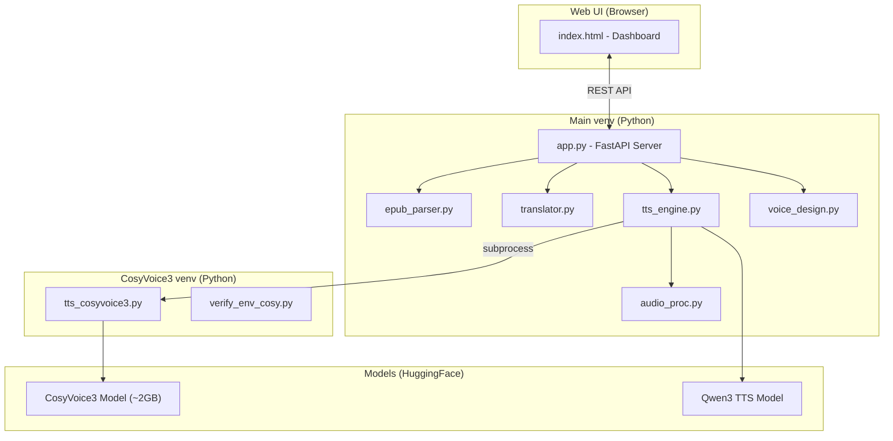

# CosyAudiobook 🍎🔊

> **EPUB → Audiobook** converter for Apple Silicon, powered by MLX + CosyVoice3 / Qwen3 TTS.  
> 100% offline · Zero-shot voice cloning · Built-in translation · Modern Web UI

---

## ✨ Features

| Feature | Description |
|---------|-------------|
| 🔒 **100% Offline & Private** | All processing happens on your Mac. No data leaves your device. |
| ⚡ **Apple Silicon Optimized** | Built on Apple's [MLX](https://github.com/ml-explore/mlx) framework for maximum GPU/Neural Engine utilization. |
| 🎙️ **Voice Cloning** | Clone any voice from a 5–10 second audio sample (CosyVoice3, zero-shot). |
| 🗣️ **Dual TTS Engines** | **CosyVoice3** for voice cloning, **Qwen3** for built-in voice presets. |
| 📖 **Smart Chapter Detection** | Auto-skips TOC, copyright pages, and non-story content. |
| 🌐 **EPUB Translation** | Translate between languages (JA↔ZH, EN↔ZH, etc.) before generating audio. |
| 🎨 **Voice Designer** | Create custom voice styles with the built-in voice design tool. |
| 💻 **Modern Web UI** | Dark-mode dashboard with real-time progress tracking. |

## 🏗️ Architecture Overview



> The project uses **two separate virtual environments** to avoid dependency conflicts between the main API and CosyVoice3's specific requirements.

## 🛠 Prerequisites

- **Hardware**: Mac with Apple Silicon (M1 / M2 / M3 / M4)
- **OS**: macOS 14.0+ (Sonoma or later recommended)
- **Software**: Python 3.10+, FFmpeg

```bash
# Install FFmpeg (if not already installed)
brew install ffmpeg
```

## 🚀 Quick Start

### Option A: Portable Package (Recommended)

1. Download `CosyAudiobook_Mac_Portable.zip` from [Releases](https://github.com/mengtsan/EbookTools/releases)
2. Unzip and double-click `start_app.command`
3. Browser opens automatically at http://localhost:8000

### Option B: From Source

```bash
git clone https://github.com/mengtsan/EbookTools.git
cd EbookTools
chmod +x start_app.command
./start_app.command
```

> [!NOTE]
> **First launch** auto-creates two virtual environments and installs all dependencies (~5 min).  
> **Subsequent launches** skip installation entirely and start in seconds.

## 📖 Usage Guide

### 1. Upload Reference Voice
Upload a WAV or MP3 file (~10 seconds of clean speech) for voice cloning.

### 2. Upload EPUB
Drag & drop your EPUB file. The parser auto-detects chapters and filters non-content pages.

### 3. Choose TTS Model
- **CosyVoice3** — Uses your uploaded reference voice (voice cloning)
- **Qwen3** — Uses built-in voice presets (no reference needed)

### 4. Select Chapters & Generate
Check the chapters you want, click "Start Generation", and monitor real-time progress.

### 5. Download
Download individual chapter MP3s or the complete audiobook.

> [!NOTE]
> The first generation will download model weights from Hugging Face (~2GB).  
> All subsequent runs work **fully offline**.

## 📂 Project Structure

```
EbookTools/
├── app.py                      # FastAPI backend server
├── start_app.command            # One-click Mac launcher
├── package_for_release.sh       # Portable zip packager
├── requirements.txt             # Main env dependencies
├── requirements_cosy.txt        # CosyVoice3 env dependencies
├── VERSION                      # Version tracking
│
├── core/                        # Core modules
│   ├── tts_engine.py            # TTS engine dispatcher
│   ├── tts_cosyvoice3.py        # CosyVoice3 subprocess worker
│   ├── tts_qwen3.py             # Qwen3 TTS worker
│   ├── epub_parser.py           # EPUB parsing & chapter detection
│   ├── epub_writer.py           # EPUB writing (translated output)
│   ├── translator.py            # Translation engine
│   ├── translator_worker.py     # Translation subprocess worker
│   ├── voice_design.py          # Voice designer
│   ├── voice_design_worker.py   # Voice design subprocess worker
│   ├── audio_proc.py            # Audio stitching & MP3 export
│   ├── transcribe.py            # Speech-to-text (MLX Whisper)
│   └── verify_env_cosy.py       # Environment integrity checker
│
├── static/
│   └── index.html               # Web UI (single-page app)
│
├── voices/                      # Reference voice samples (user uploads)
├── uploads/                     # Uploaded EPUB files
├── output/                      # Generated audiobook files
└── translations/                # Translated EPUB files
```

## 🔧 Troubleshooting

> For deep technical details, architecture overview, and development guidelines, please refer to the **[System Architecture & Development Guide (Issue R3)](issue_r1.md)**.

| Problem | Solution |
|---------|----------|
| Port 8000 already in use | Run `pkill -f uvicorn` or change port |
| Model download fails | Ensure internet connection (first run only) |
| `No module named 'einops'` | Delete `venv_cosyvoice3/` folder and restart |
| pip install errors | Run `pip cache purge` then retry |
| 0-byte output files | Check `install.log` for error details |
| "Unidentified developer" warning | Right-click → Open, or allow in System Settings → Privacy & Security |
| Double-click doesn't work | Right-click `start_app.command` → Open |

## 🔄 How the Dual-venv System Works

The project maintains **two virtual environments** to handle dependency conflicts:

| Environment | Purpose | Key Packages |
|-------------|---------|-------------|
| `venv/` | Main API server, Qwen3 TTS | FastAPI, torch, mlx, mlx-audio |
| `venv_cosyvoice3/` | CosyVoice3 voice cloning | mlx-audio, mlx-audio-plus, mlx-lm |

The main server (`app.py`) runs in `venv/` and spawns CosyVoice3 as a **subprocess** using `venv_cosyvoice3/bin/python`, communicating via JSON over stdout/stderr.

A **marker file system** tracks installation state:
- `venv/.installed_{hash}` — checksum of `requirements.txt + requirements_cosy.txt`
- If the hash changes (you updated dependencies), the environment auto-reinstalls.

## 📜 License

MIT License

## 🙏 Acknowledgments

- [MLX](https://github.com/ml-explore/mlx) — Apple's machine learning framework
- [CosyVoice](https://github.com/FunAudioLLM/CosyVoice) — Zero-shot voice cloning
- [mlx-audio](https://github.com/Blaizzy/mlx-audio) — MLX audio models
